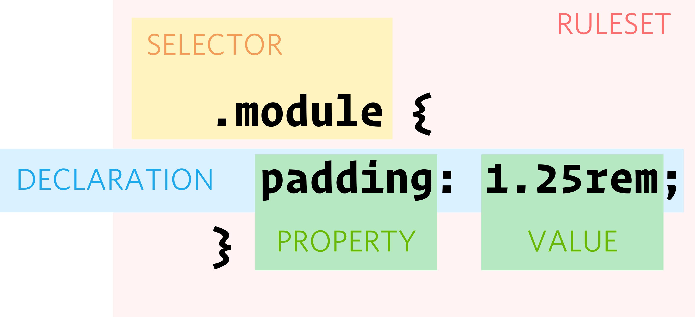

# Making sense of CSS

---

## Agenda

1. CSS Selectors
2. CSS Combinators
3. Specificity, inheritance, and importance
4. Quiz

--

* https://www.w3schools.com/css/css_syntax.asp (https://www.w3schools.com/css/selector.gif)

---

## CSS Selectors

--

### CSS Anatomy



--

### Tags, Attributes, Classes, Pseudo-Classes, & ID Selectors

```css

div { /* all divs */ }

[href], { /* anything with an alt attribute */ }

[href="http://www.google.com"] {
    /* target just hrefs for google */
}

:hover { /* targets anything you hover over */ }

.foo { /* anything with class foo */ }

#bar { /* the only element with id=bar */ }

```

--

### How do I target `Hello`, `World`, and `Eric`?

```html
<div>
    <span>Hello</span> <span class="world">World</span>
</div>

<div id="primary">
    My name is <span>Eric</span> 
</div>
```

--

What would this look like in the browser?

```html
<div>
    <span>Hello</span> <span class="world">World</span>
</div>

<div id="primary">
    My name is <span>Eric</span> 
</div>
```

```css
div {
    background-color: green;
}

span {
    color: blue;
}

.world {
    color: green;
}

#primary {
    background-color: orange;
}
```

--

### How would I...

Target just the `<span>Eric</span>`?

```html
<div>
    <span>Hello</span> <span class="world">World</span>
</div>

<div id="primary">
    My name is <span>Eric</span> 
</div>
```

--

### Multiple Classes
* HTML elements can have multiple classes
* Separate class names with a space

```html
<div class="message error primary">
    ...
</div>
```
```css
.message {
    /* ... */
}

.error {
    /* ... */
}

.primary {
    /* ... */
}
```

---

## CSS Combinators
Allows us to target different elements based on their structural relationship to other selectors

Note:
When you see a combinator, read this as saying, “only if”. A combinator is telling you that this style applies only if certain conditions are met in the HTML document — namely that HTML elements are organized in a specific way. This is the closest you can get to having actual logic in CSS.

--

### Descendant Selectors

```css
div span {
    color: blue;
}

#primary span {
    font-weight: bold;
}

section .error {
    color: red;
}
```

Note:
- The space means ancestor (child)
- Only the part of the selector closest to the "{" is targeted (target selector)
--

### What's the difference?
```css
section .error {
    /* Who do I affect? */
}

section.error {
    /* And what about me? */
}
```

```html
<body>
    <section>
        <div class="error">...</div>
        <article>
            <span class="error">...</span>
        </article>
    </section>

    <section class="error">
        ...
    </div>
</body>
```

--

## Other CSS Combinators

* Descendant selector (`space`)
* Child selector (`>`)
* Adjacent sibling selector (`+`)
* General sibling selector (`~`)

---

## Cascading Style Sheets
### Specificity, inheritance, and importance

Note:

Now that we are feeling pretty good about CSS, let's look at some more complicated examples.

---

# What's the cascade?

"It is an algorithm defining how to combine property values originating from different sources. It lies at the core of CSS as stressed by its name: Cascading Style Sheets."

* User-agent stylesheet (browser default styles)
* User custom style sheets
* Author defined style sheets (the ones you make)

---

## Specificity
Who wins?

```css
div {
  color: blue;
}

#primary-success {
  color: orange;
}

body div {
  color: yellow;
}

.message {
  color: green;
}
```
```html
<body>
    <div id="primary-success" class="message">What color am I?</div>
</body>
```

Note:

- Specificity refers to how specific a selector is
--

### Specificity

CSS rules that are more specific win.

--

### Specificity

`id`s > `class`es > tags

--

### What color is it?

```html
<p>
    <span>
        Hello World!
    </span>
</p>
```

```css
p span {
    color: yellow;
}

span {
    color: red;
}
```

--

### Specificity

More combinators > fewer combinators

```css
p span {
    /* I win! */
    color: yellow;
}
span {
    /* I lose :( */
    color: red;
}
```

--

### What color is it?

```html
<p>
    <span class="cool-span" style="color: indigo">
        Hello World!
    </span>
</p>
```

```css
.cool-span {
    color: yellow;
}
span {
    color: red;
}
```

--

### Specificity

Inline styles > *mostly* everything

--

### What color is it?

```html
<p>
    <span>
        Hello World!
    </span>
</p>
```

```css
span {
    color: yellow;
    font-weight: bold;
}
span {
    color: red;
}
```

Note:

Sidenote - the font-weight would still be bold since the second rule does not override this value.

--

### How specificity *actually* works

* Start at 0
* \+ 1000 for inline style attribute
* \+ 100 for each ID
* \+ 10 for each attribute, class or pseudo-class
* \+ 1 for each element name or pseudo-element.
```css
body #content .data img:hover {}
```
The specificity value would be `122` (`0,1,2,2` or `0122`)

Note:
100 for `#content`, 10 for `.data`, 10 for `:hover`, 1 for `body` and 1 for `img`

--

### But generally just remember

`id`s > `class`es > tags

--

### Specificity
#### Order

Given equal specificity, order matters.

(The last rule wins.)

Note:

Also matters in the order stylesheets are loaded.

--

### Tip:
Can add specificity without adding classes

```html
<div class="message">
    ...
</div>
```
```css
.message {
    /* does its thing */
}
.message.message {
    /* This is more specific */
}
```

---

### Importance

The effects of *specificity* can be negated by `!important`

--

### `!important`

```html
<p>
    <span>
        Hello World!
    </span>
</p>
```

```css
span {
    color: yellow !important;
}
span {
    color: red;
}
```

Note:
Remember when I said inline styles trump *mostly* everything? `important!` trumps those guys.

--

### `!important`

```html
<p>
    <span>
        Hello World!
    </span>
</p>
```

```css
span {
    color: yellow !important;
}
span {
    color: red !important;
}
```

--

### Importance

If two rules have equal importance, go back to specificity rules

--

### `!important` = No Dice!\*

<small>_\* Arguably this is okay when used thoughtfully in larger systems such as ITCSS_</small>

---

## Inheritance

--

### What Color is it?

```html
<p>
    Hello <span>World</span>
</p>
```

```css
p {
    color: blue;
}
```

--

### Inheritance

Children inherit the styles of their parents (well, [some of them](https://www.w3.org/TR/CSS21/propidx.html)).

--

### What color is it?

```html
<p>
    Hello <span>World</span>
</p>
```

```css
p {
    color: blue;
}
span {
    color: red;
}
```

--

### Inheritance
#### Proximity matters

Directly styling something is more specific than inherited styles.

---

## Quiz!

--

Given this HTML:

```html
<p id="abstract" class="subtitle">Hello, world!</p>
```

And this CSS:

```css
#abstract {
  background-color: darkkhaki;
}

p {
  background-color: dimgray;
}

.subtitle {
  background-color: mediumorchid;
}
```

What will the background color of the paragraph be?

--

Given this HTML:

```html
<p id="abstract" class="subtitle">Hello, world!</p>
```

And this CSS:

```css
#abstract {
  background-color: darkkhaki;
}

p {
  background-color: dimgray;
}

.subtitle {
  background-color: mediumorchid !important;
}
```

What will the background color of the paragraph be?

--

Given this HTML:

```html
<p id="abstract" style="background-color: red;">Hello, world!</p>
```

And this CSS:

```css
#abstract {
  background-color: darkkhaki;
}

p {
  background-color: dimgray;
}
```

What will the background color of the paragraph be?

--

Given this HTML:

```html
<div>
    <span>
        <strong>
            Hello, World!
        </strong>
    </span>
</div>
```

And this CSS:

```css
div {
    color: red;
}
span {
    color: yellow;
}
```

What will the color of the strong be?

--

Given this HTML:

```html
<div>
    <span>
        <strong>
            Hello, World!
        </strong>
    </span>
</div>
```

And this CSS:

```css
strong {
    color: red;
}
span {
    color: yellow;
}
```

What will the color of the strong be?

--

Given this HTML:

```html
<div>
    <span>
        <strong>
            Hello, World!
        </strong>
    </span>
</div>
```

And this CSS:

```css
strong {
    color: red;
}
div span strong {
    color: purple;
}
span strong {
    color: yellow;
}
```

What will the color of the strong be?

---

## Questions? 🙄

