# Responsive CSS Layouts
### Flexbox with Mobile First Responsive Web Design

---

## Agenda

1. Building layouts with Flexbox
2. The basics of Responsive Web Design (RWD)
3. Mobile First: RWD done responsibly

---

## Building layouts with Flexbox

--

### What is flexbox?

* CSS3 Module
* Used for **single** dimention layout (row or column)
* Strong browser support
 * IE11+\*, Edge, Firefox, Chrome, Safari 9+, iOS Safari 8.4+, Android Browser 4.4+

Note:
* IE11 support is a little buggy but you can usually work around it
* Can be used in almost every case where you may have previously relied on floats + clearfix

--

### Primer: Box Model

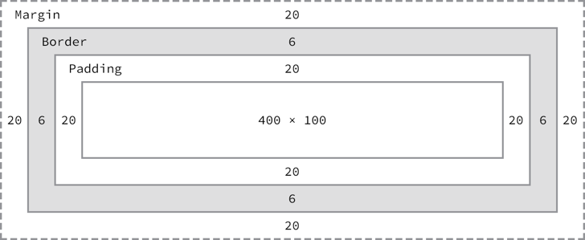

```css
div {
  /* default => box-sizing: content-box; */
  border: 6px solid #949599;
  height: 100px;
  margin: 20px;
  padding: 20px;
  width: 400px;
}
```

Note:
Every element on the page is a rectangular box and follows the box model (therefore its kinda important to understand)

--

### How does it work?

Define a flex container: `row` or `column`

```css
.flex-row {
  display: flex;
  flex-direction: row; /* this is the default */
}

.flex-col {
  display: flex;
  flex-direction: column;
}
```

Note:
* Define a container. 
* Key part is simply setting display: flex - creates a flex container
* Optionally you can define a direction but the default is row.
* Automatically, all the immediate children of the flex container are now treated as flex items that allows you to manipulate varying flex properties (more on this later)

--

### Flex Axis: Justify v. Align

* Main axis matches `flex-direction` axis
 * Manipulated via `justify-content`
* Cross axis is always the *other* axis
 * Manipulated via `align-items`

Note:
* If you’ve used flexbox at all, you’ve likely encountered two oddly named CSS properties: justify-content and align-items
* A flexbox container has two axis that allow you to position items along.
* The primary axis, or main axis, is the the axis corresponding with the the flex-direction you’ve set. flex-direction: row means the main axis is the x-axis. Else, its the y-axis
* The cross-axis is always the other axis.
* You manipulate the position of items along the main axis via the justify-content property
* And the cross axis via the align-items property.

--

### Position flex items

Set `justify-content` and `align-items` on the flex container

```css
.flex-container {
  display: flex;
  /* No flex-direction specified, so its a row */
  justify-content: center;
}
```

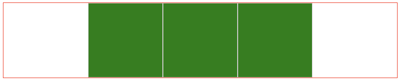

--

### Position flex items

```css
.flex-container {
  display: flex;
  flex-direction: column;
  align-items: center;
}
```
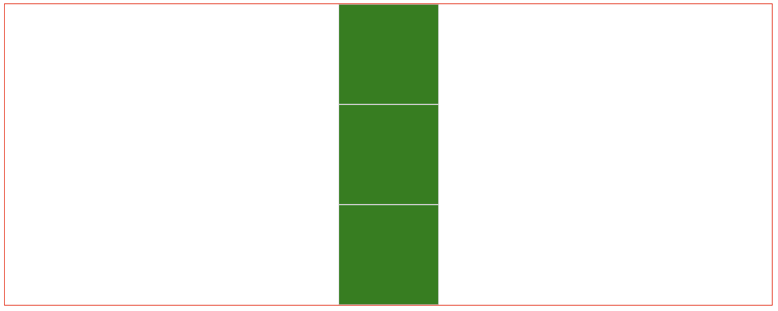
--

### `justify-content` values

| | | |
|-|-|-|
| flex-start (default)| 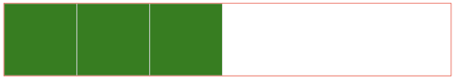 |
| flex-end | 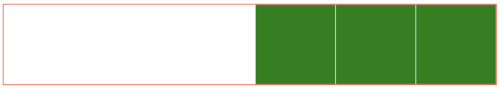 |
| center | 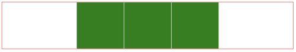 |
| space-between |  |
| space-around |  |

Note:
This is using flex-direction: row

--

### `align-items` values

| | | |
|-|-|-|
| flex-start | 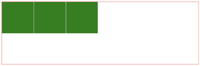 |
| flex-end | 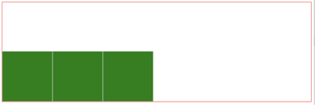 |
| center | 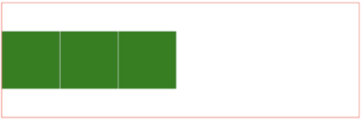 |
| stretch (default) | 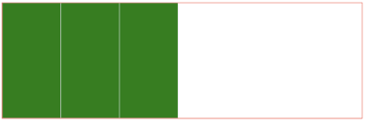 |

Note:
* Still using flex-direction: row
* I didn’t include all options here but not all are easily demo-able here
* Also for demo purposes, I set an explicit height on the flex-container

--

### Flex item CSS properties

* Flex items are defined by their immediate parent with:
 * `display: flex;` or
 * `display: inline-flex;`
* Can control cross axis alignment with CSS property `align-self`

Note:
* There is no CSS display: flex-item. 
* Flex items are created by their parent having `display: flex` or `flex-inline`
* Individual flex items can override their own display along the cross-axis by using the CSS property `align-self`

--

### Using `align-self`

```css
.item:nth-of-type(1){
  align-self: flex-start;
}
.item:nth-of-type(2){
  align-self: flex-end;
}
.item:nth-of-type(3){
  align-self: center;
}
.item:nth-of-type(4){
  align-self: stretch;
}
```

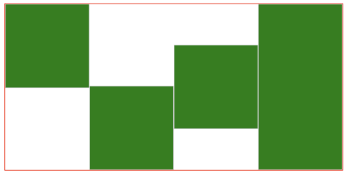

Note:
Regardless of what our flex container set the align-content to, each of these override that value

--

### Changing the `order`

```css
.item:nth-of-type(1){
  order: 2;
}
.item:nth-of-type(2){
  order: 1;
}
.item:nth-of-type(3){
  order: 4;
}
.item:nth-of-type(4){
  order: 3;
}
```

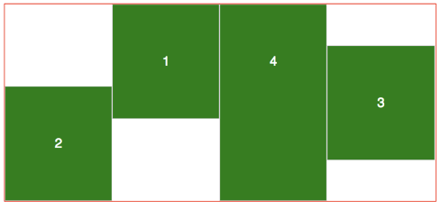

Note:
You an also reorder elements cleanly with CSS

--

### Distributing space

* Each flex item can control how much it shrinks or grows
* `flex-grow`: how much space do I want to consume relative to my siblings
* `flex-shrink`: how much am I willing to shrink relative to my siblings

`flex-grow` demo: http://codepen.io/ericmasiello/pen/XdxGbv?editors=1100

Note:
* Flex items will take up as much space as they need based on their inner content and other CSS properties – just like most things in CSS
* Flex grow says, how much of the remaining free space should I take up relative to my flex item siblings
* And flex shrink says - if we start to run out of space within the flex container, how much should I shrink relative to my flex item siblings.
* Emphasis on *relative to*

--

### Let's build a feature card

* [Starter code](http://codepen.io/ericmasiello/pen/aperxY?editors=1100)
* [Finished code](http://codepen.io/ericmasiello/pen/EZqzzQ?editors=1100)

--

### Let's build an entire layout

* [Starter code](http://codepen.io/ericmasiello/pen/aNRMjm?editors=1100)
* [Finished code](http://codepen.io/ericmasiello/pen/jqJgvX?editors=1100)

---

## The Basics of Responsive Web Design (RWD)

--

> Responsive Web design is the approach that suggests that design and development should respond to the user’s behavior and environment based on screen size, platform and orientation.

_[Smashing Magazine](https://www.smashingmagazine.com/2011/01/guidelines-for-responsive-web-design/)_

--

#### How do we this?

Media Queries

```css
.grid {
    display: flex;
    flex-direction: column;
}
@media(min-width: 600px) {
    .grid {
        flex-direction: row;
        flex-wrap: wrap;
    }
    .grid > * {
        width: 50%;
    }
}
@media(min-width: 800px) {
    .grid > * {
        width: 33.333%;
    }
}
```
See _[Using Media Queries](https://developer.mozilla.org/en-US/docs/Web/CSS/Media_Queries/Using_media_queries)_ for a more detailed spec

--

#### What's this actually doing?

Across all devices (note: no media query), we add this ruleset

 ```css
.grid {
    display: flex;
    flex-direction: column;
}
```

When the screen >= 600px wide, we _also_ add these rulesets

```css
@media(min-width: 600px) {
    .grid {
        flex-direction: row;
        flex-wrap: wrap;
    }

    .grid > * {
        width: 50%;
    }
}
```

--

#### What are the net styles at this point?

screen width \>= 600px

```css
.grid {
    display: flex;
    flex-direction: row;
    flex-wrap: wrap;
}

.grid > * {
    width: 50%;
}
```

screen width \>= 800px

```css
.grid {
    display: flex;
    flex-direction: row;
    flex-wrap: wrap;
}

.grid > * {
    width: 33.333%;
}
```

--

#### A note on specificity

Media queries do **not** add specificty.

```css

.grid {
    display: flex;
    flex-direction: column;
}

@media(min-width: 600px) {
    .grid {
        flex-direction: row;
        flex-wrap: wrap;
    }
}
```
Each instance of `.grid` have equal specificity. So why does the one in the media query win?


Note:

In CSS, when two things have equal specificity, the last one wins

---

## RWD done responsibly

--

## Mobile First

1. Start by building the UI for the smallest screen you plan to support (typically phones)
2. Upon completion, incrementally expand your device size (both width _and_ height) until it warrants a change (read: add a media query here)
3. Rinse and repeat step 2 until you've reached desktop size

--

### Why mobile first?

* **Constraints**: Easier to loosen constraints as you build rather than adding them after the fact
* **Priorities**: Forces you to consider what matters most to customers/business.
* **Performance**: Makes it easier to consider bandwidth constraints performance early on

Note:

* **Constraints**: When developing, its easier to loosen constraints as you build rather than adding them after the fact. Small screen = most constrained. Large scree = least constrained
* **Priorities**: Small screens force you to consider what matters most to customers/business. 
* **Performance**: Starting mobile first makes it much easier to consider bandwidth constraints and slower device performance (_think_ low powered devices on poor 3G connections)

--

### Why mobile first?

> Small screen sizes force you to prioritize what really matters to your customers and business. There simply isn’t room for anything else. Slow connections and limited data plans require you to “be vigilant about performance, resulting in fast-loading websites everywhere.

_Luke Wroblewski - "Mobile First"_

--

### Comparing Mobile to Desktop First

Mobile First

```css
.grid {
    display: flex;
    flex-direction: column;
}
@media(min-width: 600px) {
    .grid {
        flex-direction: row;
        flex-wrap: wrap;
    }
    .grid > * {
        width: 50%;
    }
}
@media(min-width: 800px) {
    .grid > * {
        width: 33.333%;
    }
}
```

--

### Comparing Mobile to Desktop First

Desktop First (3 more lines of code)
```css
.grid {
    display: flex;
    flex-wrap: wrap;
}
.grid > * {
    width: 33.333%;
}
@media(max-width: 799px) {
    .grid > * {
        width: 50%;
    }
}
@media(max-width: 599px) {
    .grid {
        flex-direction: column;
        flex-wrap: nowrap;
    }
    .grid > * {
        width: 100%;
    }
}
```

--
### Tip

Write your media queries _with_ your responsive components. Do not write them all at the end of some massive CSS document.

--
### Applied to SCSS

```scss
.grid {
    display: flex;
    flex-direction: column;

    @media(min-width: 600px) {
        flex-direction: row;
        flex-wrap: wrap;

        .grid > * {
            width: 50%;
        }
    }

    @media(min-width: 800px) {
        .grid > * {
            width: 33.333%;
        }
    }
}
```

---

## Resources 📚

* [Flexbox Froggy](http://flexboxfroggy.com/)
* [Responsive Design Patterns](https://bradfrost.github.io/this-is-responsive/patterns.html)
* [More Responsive Design Patterns](https://responsivedesign.is/patterns/)

---

## Questions? 🙄

