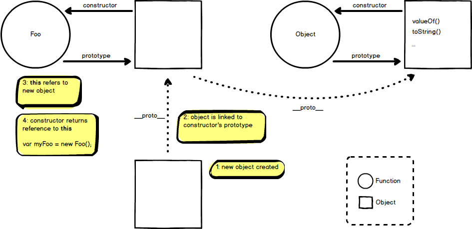

# How `this` actually works in JS

---

## Agenda

1. The global `this`
2. How `this` is applied within functions
3. Making `this` easier with class properties

---

## What is `this`?

<u>Dynamic</u> context

Note:
* While executing, every JS function has a reference to a context called `this`
* How the value of `this` is determined by both (1) how and (2) where the function is called

---

## The global `this` 🌍

`this` referenced outside of a function

* Browser: `this === window`
* Node REPL: `this === global`
* In a Node Module: `this === module.exports`

--

### `var`s in a the browser & node REPL

`var`s declared outside of a function are members of the `window`/`global` object

```js
var foo = () => console.log('fooing');
let bar = () => console.log('barring');
const baz = () => console.log('bazzing');

window.foo === foo; // true
window.bar === bar; // false
window.baz === baz; // false
```

Note: this is also true in `'use strict'` mode

--

### `var`s in node modules

a.js
```js
var foo = () => console.log('fooing');

console.log(this);
console.log(foo);
console.log(this.foo);
```
b.js
```js
const a = require('./a');
/*
{}
[Function: foo]
undefined
*/
```
---

## How `this` is applied within functions
#### The <del>four</del> <ins>five</ins> rules for `this`

Note: `this` has nothing to do with object orientation or classes. Its entirely about the _call_ site

--

### 1. The default binding rule

`this` is the global object unless in strict mode

```js
function foo() {
  return this === window;
}
foo();

function bar() {
  'use strict'
  return this === undefined;
}
bar();
```

--

### 2. The implicit binding rule

The owning object at the call site becomes `this`

```js
function foo() {  
  console.log(this.name);
}
const o1 = {
  name: 'First',
  foo: foo
};
const o2 = {
  name: 'Second',
  foo, // ES6 shorthand
};

foo(); // undefined
o1.foo(); // "First"
o2.foo(); // "Second"
```

--

### 3. Explicit binding (at call site)

Use `.call` or `.apply`

```js
var name = 'The Window'; // window.name === 'The Window'

function foo(a, b) {  
  console.log(this.name, a, b);
}

var obj = { name: 'The Object' };

foo('a', 'b'); // 'The Window', 'a', 'b'

foo.call(obj, 'c', 'd'); // 'The Object', 'c', 'd'
foo.apply(obj, ['e', 'f']); // 'The Object', 'e', 'f'
```
What would happen if `foo` was in strict mode?

Note: 
* All functions have two methods on their prototype called `call` and `apply`
* What's the difference?
 * `call` think "comma"
 * `apply` think "array"

--

### 3.1 Hard binding

Makes `this` keyword bound to a specific context

```js
var name = 'The Window';

function foo() {  
  console.log(this.name);
}

var obj = { name: 'The Object' };

foo = foo.bind(obj); //hard binding

foo(); // 'The Object'
foo.call(obj); // 'The Object'
foo.apply(obj); // 'The Object'
```

--

### Quiz

Will clicking on the button work?

```js
class Clicker extends React.Component {
  constructor(props) {
    super(props);
    this.state = { count: 0 };
  }

  handleUpdateCount() {
    this.setState({ count: this.state.count + 1 });
  }

  render() {
    return (
      <button onClick={this.handleUpdateCount}>
        Count {this.state.count}
      </button>
    );
  }
}
```

--
### Quiz Part 2

Will this work?

```js
class Clicker extends React.Component {
  constructor(props) {
    super(props);
    this.state = { count: 0 };
  }

  handleUpdateCount() {
    this.setState({ count: this.state.count + 1 });
  }

  render() {
    return (
      <button onClick={this.handleUpdateCount.bind(this)}>
        Count {this.state.count}
      </button>
    );
  }
}
```
Can it be improved?

--
### Quiz Part 3

Explain what's happening here with `this` and `handleUpdateCount`?

```js
class Clicker extends React.Component {
  constructor(props) {
    super(props);
    this.state = { count: 0 };
    this.handleUpdateCount = this.handleUpdateCount.bind(this);
  }

  handleUpdateCount() {
    this.setState({ count: this.state.count + 1 });
  }

  render() {
    return (
      <button onClick={this.handleUpdateCount}>
        Count {this.state.count}
      </button>
    );
  }
}
```

--

### 4. Using `new`

`new` treats _any_ function call as a constructor

--

### What `new` does

1. A brand new object is created
2. The new object is linked to the constructor's prototype
3. The new object is bound as `this` in the constructor
4. If the constructor doesn't explicitly return anything, it will implicitly return `this`

```js
var globalBar = 'bar';

function Foo() {
  this.name = 'The foo';
  console.log(this.globalBar);
}

Foo(); // logs 'bar'
var foo1 = new Foo(); // logs undefined
console.log(foo1.name); // logs 'The foo'
```
--

### Bonus
More detail than you probably cared to learn about constructor calls



--

### 5. Arrow functions
* Always inherit the parent context's `this` value
* `bind`, `apply`, and `call` are ignored
* Putting `new` in front of an arrow function will throw an error

```js
var name = 'The Window';
const foo = () => {
  console.log(this.name);
}
const o1 = { name: 'Object 1' };

foo(); // 'The Window';
foo.call(o1); // 'The Window';
foo.apply(o1); // 'The Window';
foo.bind(o1)(); // 'The Window';
```

Note:
* Why did I need a second set a parenthesis on `foo.bind`?

--
### Quiz

What will be printed to the screen?

```js
window.name = 'The Window';

const o1 = {
  name: 'The Object',
  foo: () => console.log(this.name)
};

o1.foo();
```

Note:
* `'The Window'`

--
### Quiz

What will be printed to the screen?

```js
window.name = 'The Window';

const o1 = {
  name: 'The Object',
  foo() {
    return () => console.log(this.name);
  },
};

o1.foo()();
```

Note:
* `'The Object'`

---

### Order of precedence

1. Is it an arrow function?
2. Was it called with `new` keyword?
3. Was it called with `bind`?
4. Was it called with `call` or `apply`?
5. Was there an owning/containing object?
6. Else, default global object

---

## Babel Super Tip

--

### Forcing `this` binding

In order for `this` to be what we want, we need to create a `constructor` 🙄
```js
class Clicker extends React.Component {
  constructor(props) {
    super(props)
    this.handleUpdateCount = this.handleUpdateCount.bind(this);
  }

  handleUpdateCount() {
    console.log('this', this);
  }

  render() {
    return (
      <button onClick={this.handleUpdateCount}>
        Click me
      </button>
    );
  }
}
```

--

### Forcing `this` binding

Use Babel's `transform-class-properties` plugin to support ES Class Fields & Static Properties
```js
class Clicker extends React.Component {
  handleUpdateCount = () => { // arrow functions!
    console.log('this', this);
  }

  render() {
    return (
      <button onClick={this.handleUpdateCount}>
        Click me
      </button>
    );
  }
}
```

--

### Setting instance and `static` properties

```js
class Clicker extends React.Component {
  static defaultProps = {
    message: 'Count',
  };

  state = { count: 0 };

  handleUpdateCount = () => {
    this.setState({
      count: this.state.count + 1,
    });
  }

  render() {
    return (
      <button onClick={this.handleUpdateCount}>
        {this.props.message}: {this.state.count}
      </button>
    );
  }
}
```

---

## Resources & Credits 📚

* [Kyle Simpson _You Don’t Know JS_ book series](https://www.amazon.com/Kyle-Simpson/e/B006MAHIQ6/ref=pd_sim_14_bl_1?_encoding=UTF8&refRID=1B2A83TFWJB2QXGGAKJJ)
* [_Understand JavaScript's this Keyword in Depth_ on Egghead](https://egghead.io/lessons/javascript-this-in-the-global-context)
* [Babel Class Properties Transform Plugin](https://babeljs.io/docs/plugins/transform-class-properties/)

---

## Questions? 🙄

