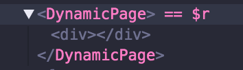
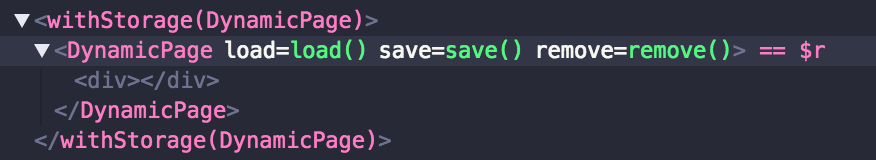

# Smart Components in React
## Part 1: <del>Mixins</del> and Higher Order Components

---

## Setup

1. `git clone https://github.com/ericmasiello/front-end-learning-guild.git`
2. `cd front-end-learning-guild/smart-components/exercises/01-basic-hoc`
3. (if you have nvm) `nvm use`
4. `npm install`
5. `cd ../02-localstorage-hoc`
6. `npm install`

---

### What can smart components used for?

* Shared/cross-cutting concerns
* Fetching data sources, e.g. `fetch()`
* Producing side effects (e.g. track an analytics event when the component mounts)

--

### Benefits of Smart Components

* Promotes resuability of presentational/dumb components
* Separates app logic from UI logic
* Can aleviate "prop drilling"

Note:
* Presentational/dumb components can be used with different data sources
* You just need to adhere to their API

--

### Statefulness

i.e. Does the component use `this.state`?

* Dumb components tend to be stateless
* Smart components tend to be stateful
* ...But this isn't a hard rule

--

### What are smart components **NOT** used for

Rendering `<JSX />` with styles directly

Note:
At most, smart components may render a wrapping container element like a `<div />` but nothing more


---

## Ways to implement

* <del>Mixins</del>
* Higher Order Components
* Render Props

---

## What's a React mixin?

* <u>Deprecated</u> way of sharing functionality between React components
* Required use of `React.createClass()`

```
const MyMixin = {
  renderSomeone() {
    return <span>Someone</span>
  }
}

const MyComponent = React.createClass({
  mixins: [MyMixin],
  render() {
    return (<div>Hello, {this.renderSomeone()}</div>);
  }
});
```

--

### Mixins = no good

* Bidirectional dependency between mixins and components makes refactoring error prone
* Mixins can include their own mixins
* Name collisions between components and mixins (or other mixins)
* See https://reactjs.org/blog/2016/07/13/mixins-considered-harmful.html

Note:
* Because components can call mixin methods and mixins can call component methods, you can't safely assume that a find/replace to rename/refactor something in a module will cover your bases. You also need to look at the mixins included the component or components that include that mixin.
* Problem is worsed by the fact that mixins can include their own mixins making the problem even worse
* its one thing if you own authored the mixin and can simply rename it but what if you're using a 3rd party mixin with another 3rd party mixin
* 

---

## Higher Order Components (HOCs)

A function that takes a React Component and returns a new, wrapped React Component

---

## How to write an HOC

--

### Why?
Imagine we have many components that need the same data

```js
class Page1 extends React.Component {
  state = {
    data: [],
  };
  componentDidMount() {
    fetch('/the/data')
      .then(result => result.json())
      .then(data => this.setState({ data }));
  }
  render() {
    return (
      <div className="page-1">
        Page 1 ... {this.state.data}
        <a href="/page2">Next</a>
      </div>
    );
  }
}
```

--

### And then...

```js
class Page2 extends React.Component {  
  state = {
    data: [],
  };
  componentDidMount() {
    fetch('/the/data')
      .then(result => result.json())
      .then(data => this.setState({ data }));
  }
  render() {
    return (
      <div className="page-2">
        Page 2 ... {this.state.data}
        <a href="/page1">Back</a>
      </div>
    );
  }
}
```
--

### Some observations

* We had to make each of these components `class`es in order to leverage `componentDidMount`
* Both components are doing nearly the same thing in `componentDidMount`
* Data had to be stored in `state` rather than passed as `props`

--

### Make an HOC

```js
const withData = (Component) => {
  class DataWrapper extends React.Component {
    state = {
      data: [],
    };
    componentDidMount() {
      fetch('/the/data').then(result => result.json())
        .then(data => this.setState({ data }));
    }
    render() {
      return <Component data={this.state.data} />
    }
  }
  return DataWrapper;
};
```
```js
const Page1 = (props) => (
  <div className="page-1">
    Page 1 ... {props.data}
    <a href="/page2">Next</a>
  </div>
);
const Page1WithData = withData(Page1);
// Then use <Page1WithData />
```

--

### Passing props

But what if our component (the one being wrapped by the HOC) expects other `props`?

```js
const DynamicPage = ({ title, data, ...rest}) => (
  <div {...rest}>
    <h1>{title}</h1>
    The data {this.props.data}
    Some other stuff
  </div>
);
```

Note:
This component expects a prop called `title` and it expects to spread the remaining props as `...rest`

--

### Passing props in our HOC

```js
const withData = (Component) => {
  class DataWrapper extends React.Component {
    state = {
      data: [],
    };
    componentDidMount() {
      fetch('/the/data')
        .then(result => result.json())
        .then(data => this.setState({ data }));
    }
    render() {
      // forward along any props set on the wrapper down to
      // the underlying wrapped element
      return <Component {...this.props} data={this.state.data} />
    }
  }

  return DataWrapper;
};
```
```js
const DynamicPageWithTracking = withData(DynamicPage);
// Then use <DynamicPageWithTracking title="Step 3" id="foo" />
```

--

### `displayName`
`displayName` is useful when debugging with React DevTools

```js
const DynamicPage = () => <div />;

DynamicPage.displayName = 'DynamicPage';
```



--

### Applying a `displayName` to a wrapped component

```js
const withStroage = (Component) => {
  class Wrapper extends React.Component {
    // does all the stuff...
  }

  // sets the displayName using the static property displayName
  // or falling back to the function's name
  Wrapper.displayName =
    `withStorage(${Component.displayName || Component.name})`;

  return Wrapper;
};
```


--

### Hoisting statics

Static properties on wrapped components need to manually be hoisted to the wrapped component

```js
// class based static
class ComponentA extends React.Component {
  static testMessage = () => 'testing a...';
  render() {
    return <div />;
  }
}

// function based static
const ComponentB = () => <div />;
ComponentB.testMessage = () => 'testing b...';

```

--

### HOCs without hoisting non-React statics

```js
ComponentA.testMessage(); // 'testing a...'
ComponentB.testMessage(); // 'testing b...'

withSomeHOC(ComponentA).testMessage();
// Uncaught TypeError: ...testMessage is not a function

withSomeHOC(ComponentB).testMessage();
// Uncaught TypeError: ...testMessage is not a function
```
--

### How to hoist non-React statics

```js
import hoistNonReactStatic from 'hoist-non-react-statics';

const withData = (Component) => {
  class DataWrapper extends React.Component {
    // does all the stuff...
  }

  DataWrapper.displayName =
    `withData(${Component.displayName || Component.name})`;

  hoistNonReactStatic(DataWrapper, Component);

  return DataWrapper;
};
```

--

### Passing `ref`s

`ref`s can be applied to `class` based components as a way to access an underlying DOM node or component instance

```js
class Foo extends React.Component {
  elm = null;

  render() {
    return (
      <div ref={(domNode) => {
        this.elm = domNode;
      }}>
        Foo!
      </div>
    );
  };
}
```

Note:
- Not using React 16s `React.createRef();` API

--

### `ref`s in HOCs

* Passing `ref`s to HOC's won't work out of the box
* The `ref` is applied to the wrapper component, not to the wrapped one

```js
const WrappedHelloWorld = withData(HelloWorld);

class Bar extends React.Component {
  refToHelloWorld = null;

  render() {
    return (
      <div>
        <WrappedHelloWorld ref={(helloWorld) => {
          // this will actually reference DataWrapper
          // not, HelloWorld
          this.refToHelloWorld = helloWorld;
        }}} />
      </div>
    );
  }
}
```
--

### `ref` HOC pattern

```js
const withData = (Component) => {
  class DataWrapper extends React.Component {
    // does all the stuff...

    render() {
      // pass along innerRef to ref of the wrapped component
      const { innerRef, ...rest } = props;
      return <Component ref={innerRef} {...rest} data={this.state.data} />
    }
  }
  
  // do all that other stuff...
  return DataWrapper;
};
```

--
### Applying the `innerRef` pattern

```js
const WrappedHelloWorld = withData(HelloWorld);

class Bar extends React.Component {
  refToHelloWorld = null;

  render() {
    return (
      <div>
        {/* Use innerRef instead of ref */}
        <WrappedHelloWorld innerRef={(helloWorld) => {
          this.refToHelloWorld = helloWorld;
        }}} />
      </div>
    );
  }
}
```

--

### HOC considerations
* The HOC _function_ (factory) should be pure (no side-effects): just compose the original component by wrapping it in another component
* Apply `displayName`s based on the wrapped component's `displayName`
* Static methods must be copied over to still have access to them. A simple way to do this is the `hoist-non-react-statics` package
* `ref`s must be passed down via a separate prop (e.g. `innerRef`)

--
### More HOC considerations
Do not create a wrapped component within a `render` method

```js
// ...
render() {
  const BasicWithGoods = withTheGoods(BasicComponent); // <-- NO!
  return (
    <BasicWithGoods />
  );
}
```

```js
const BasicWithGoods = withTheGoods(BasicComponent); // <-- YES!

class Comp extends React.Component {
  render() {
    return (
      <BasicWithGoods />
    );
  }
}
```

---

# Exercises

--

## 1. Create a `withTracking` HOC

`01-basic-hoc`

* Run `npm test` (your tests will fail)
* Fix them by building the `withTracking` HOC
* **Hint:** Behavior is similar to `components/Step1.js`
* **Hint:** the `withTracking` HOC is a function that returns a function

```js
const config = { /* config options */ };
const Component = (props) => <div {...props} />;

const ComponentWithTracking = withTracking(config)(Component);
```

--

## 2. Create a `withStorage` HOC

`02-localstorage-hoc`

* Run `npm test` (your tests will fail)
* Fix them by building the `withStorage` HOC
* **Hint:** details on how to use the `localStorage` API are documented in `withStorage.js`
* **Hint:** the wrapped component must be passed 3 prop methods: `load('key')`, `save('key', 'value')` and `remove('key')`

```js
const Component = (props) => <div {...props} />;

const ComponentWithStorage = withStorage(Component);
```

---

## HOC Pros & Cons

* (\+) Easy to compose many HOCs
* (\+) Feels "clean" in that you're only dealing with a composed Component

* (\-) Has the same indirection problem as mixins
* (\-) Refs are not passed through (easily)

---

## Further Reading

* [Understanding React Higher-Order Components by Example](https://levelup.gitconnected.com/understanding-react-higher-order-components-by-example-95e8c47c8006)
* [Smart and Dumb Components](https://medium.com/@dan_abramov/smart-and-dumb-components-7ca2f9a7c7d0)
* [Mixins Considered Harmful](https://reactjs.org/blog/2016/07/13/mixins-considered-harmful.html)